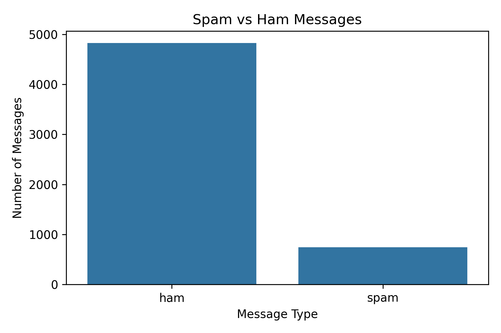
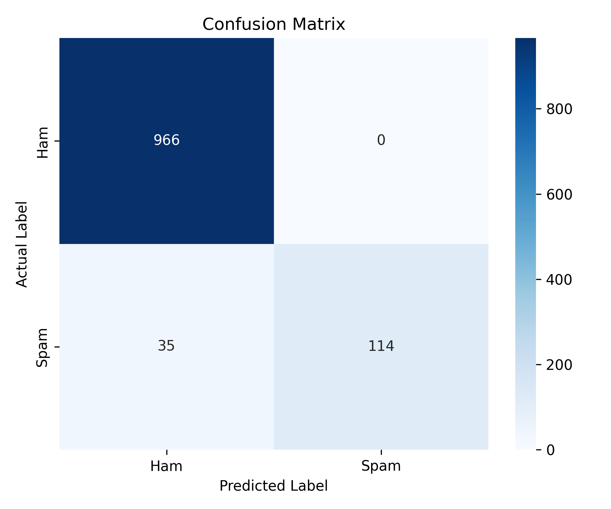

# `>_ SPAM MAIL DETECTOR`

<p align="center">

**Machine Learning × NLP × Text Classification**

A lightweight machine learning system that detects whether an SMS message is **SPAM** or **HAM** using **TF-IDF** and **Multinomial Naive Bayes**.

</p>

<p align="center">


</p>

---

## `01 // SYSTEM OVERVIEW`

```text
┌──────────────────────────────────────────────────────┐
│                SPAM MAIL DETECTOR                    │
├──────────────────────────────────────────────────────┤
│                                                      │
│  INPUT MESSAGE                                       │
│       │                                              │
│       ▼                                              │
│  TEXT PREPROCESSING                                  │
│       │                                              │
│       ▼                                              │
│  TF-IDF FEATURE EXTRACTION                           │
│       │                                              │
│       ▼                                              │
│  MULTINOMIAL NAIVE BAYES                             │
│       │                                              │
│       ▼                                              │
│  ┌──────────────┬──────────────┐                     │
│  │     HAM      │     SPAM     │                     │
│  └──────────────┴──────────────┘                     │
│                                                      │
└──────────────────────────────────────────────────────┘
```

This project demonstrates a complete **Natural Language Processing + Machine Learning** pipeline for detecting spam messages.

The model was trained using the **SMS Spam Collection dataset**.

---

## `02 // TECH STACK`

```text
Language       → Python
Data           → Pandas / NumPy
NLP            → Text Preprocessing / TF-IDF
ML             → Multinomial Naive Bayes
Evaluation     → Accuracy / Precision / Recall / F1
Visualization  → Matplotlib / Seaborn
Serialization  → Joblib
```

---

## `03 // DATASET`

The project uses the **SMS Spam Collection Dataset**, containing messages labeled as:

```text
HAM   → Legitimate message
SPAM  → Unwanted / fraudulent message
```

Example:

```text
HAM
Go until jurong point, crazy.. Available only in bugis n great world la e buffet...

SPAM
Free entry in 2 a wkly comp to win FA Cup final tkts 21st May 2005.
```

### Test Dataset

```text
Total Messages : 1115
HAM            : 966
SPAM           : 149
```

---

## `04 // TEXT PREPROCESSING`

Raw text cannot be directly used by the machine learning model.

The messages were cleaned using the following steps:

```text
[1] Convert text to lowercase
[2] Remove URLs
[3] Remove email addresses
[4] Remove unnecessary special characters
[5] Remove extra spaces
```

### Before

```text
Go until jurong point, crazy.. Available only in bugis n great world la e buffet...
```

### After

```text
go until jurong point crazy available only in bugis n great world la e buffet
```

---

## `05 // FEATURE EXTRACTION`

### TF-IDF

**TF-IDF (Term Frequency-Inverse Document Frequency)** converts text into numerical feature vectors that can be processed by a machine learning algorithm.

Configuration:

```python
TfidfVectorizer(
    stop_words="english",
    max_features=5000
)
```

```text
Maximum Features → 5000
Stop Words       → English
```

---

## `06 // CLASSIFICATION ENGINE`

The classification model used in this project is:

```text
Multinomial Naive Bayes
```

Naive Bayes is well suited for text classification because it performs efficiently with high-dimensional feature vectors such as TF-IDF.

### Classification Flow

```text
Message
   ↓
Preprocessing
   ↓
TF-IDF
   ↓
Naive Bayes
   ↓
┌───────────────┐
│ SPAM / HAM    │
└───────────────┘
```

---

## `07 // MODEL PERFORMANCE`

### Final Results

| Metric    |       Score |
| --------- | ----------: |
| Accuracy  |  **96.86%** |
| Precision | **100.00%** |
| Recall    |  **76.51%** |
| F1 Score  |  **86.69%** |

### Classification Report

```text
              precision    recall  f1-score   support

         Ham       0.97      1.00      0.98       966
        Spam       1.00      0.77      0.87       149

    accuracy                           0.97      1115
   macro avg       0.98      0.88      0.92      1115
weighted avg       0.97      0.97      0.97      1115
```

---

## `08 // DATASET ANALYSIS`

### Spam vs Ham Distribution

<p align="center">



</p>

---

## `09 // CONFUSION MATRIX`

```text
                 PREDICTED

              HAM       SPAM
           ┌────────┬────────┐
ACTUAL HAM │  966   │   0    │
           ├────────┼────────┤
     SPAM  │   35   │  114   │
           └────────┴────────┘
```

### Interpretation

```text
966 → Ham correctly classified as Ham
114 → Spam correctly classified as Spam
 35 → Spam incorrectly classified as Ham
  0 → Ham incorrectly classified as Spam
```

### Visualization

<p align="center">



</p>

---

## `10 // LIVE TESTING`

The trained model was tested with new messages that were not part of the training dataset.

### `[01]` Spam Detection

```text
INPUT
────────────────────────────────────────

Congratulations! You have won a free cash prize.
Claim now!

OUTPUT
────────────────────────────────────────

[+] CLASS      : SPAM
[+] CONFIDENCE : 97.99%
```

### `[02]` Ham Detection

```text
INPUT
────────────────────────────────────────

Hey, are you free today? Let's meet in the evening.

OUTPUT
────────────────────────────────────────

[+] CLASS      : HAM
[+] CONFIDENCE : 99.19%
```

### `[03]` Spam Detection

```text
INPUT
────────────────────────────────────────

URGENT! You have won a lottery.
Send your details to claim.

OUTPUT
────────────────────────────────────────

[+] CLASS      : SPAM
[+] CONFIDENCE : 79.97%
```

### `[04]` Ham Detection

```text
INPUT
────────────────────────────────────────

Can you please send me the assignment?

OUTPUT
────────────────────────────────────────

[+] CLASS      : HAM
[+] CONFIDENCE : 89.10%
```

---

## `11 // PROJECT STRUCTURE`

```text
Spam-Mail-Detector/
│
├── data/
│   └── SMSSpamCollection
│
├── models/
│   ├── spam_classifier.pkl
│   └── tfidf_vectorizer.pkl
│
├── results/
│   ├── class_distribution.png
│   └── confusion_matrix.png
│
├── src/
│   └── spam_detector.py
│
├── .gitignore
├── requirements.txt
└── README.md
```

---

## `12 // RUN LOCALLY`

### Clone

```bash
git clone https://github.com/ENAYATULLA/Spam-Mail-Detector.git
cd Spam-Mail-Detector
```

### Create Virtual Environment

```bash
python -m venv venv
```

### Activate — Windows PowerShell

```powershell
.\venv\Scripts\Activate.ps1
```

### Install Dependencies

```bash
pip install -r requirements.txt
```

### Run

```bash
python src\spam_detector.py
```

---

## `13 // GENERATED OUTPUT`

Running the project produces:

```text
results/
├── class_distribution.png
└── confusion_matrix.png

models/
├── spam_classifier.pkl
└── tfidf_vectorizer.pkl
```

The system also displays:

```text
[+] Model Performance
[+] Classification Metrics
[+] Confusion Matrix
[+] Custom Message Predictions
```

---

## `14 // LIMITATIONS`

```text
[!] Dataset is based on SMS messages.
[!] Performance may vary on real-world email data.
[!] New spam patterns may not always be detected.
[!] Some spam messages may be classified as ham.
[!] Dataset size is limited compared with large production datasets.
```

---

## `15 // FUTURE UPGRADES`

```text
[+] Larger and more diverse datasets
[+] Compare multiple ML algorithms
[+] Word and character n-grams
[+] Advanced NLP techniques
[+] Multilingual spam detection
[+] Real-time web interface
[+] Continuous model retraining
```

---

## `16 // WHAT I LEARNED`

Through this project, I gained practical experience with:

```text
→ Text preprocessing
→ Natural Language Processing
→ TF-IDF feature extraction
→ Machine learning classification
→ Multinomial Naive Bayes
→ Model evaluation
→ Confusion matrix analysis
→ Saving and loading ML models
→ Working with real-world text data
```

---

## `17 // REQUIREMENTS`

```text
pandas
numpy
scikit-learn
matplotlib
seaborn
joblib
```

Install everything with:

```bash
pip install -r requirements.txt
```

---

## `18 // GITIGNORE`

The local virtual environment is intentionally excluded from the repository.

```text
venv/
__pycache__/
*.pyc
.vscode/
.idea/
```

---

## `19 // PROJECT STATUS`

```text
┌─────────────────────────────────────┐
│                                     │
│   STATUS     :  COMPLETED           │
│   MODEL      :  TRAINED             │
│   ACCURACY   :  96.86%              │
│   PIPELINE   :  NLP + ML             │
│                                     │
└─────────────────────────────────────┘
```

---

## `20 // AUTHOR`

**Enayat Ullah**

Computer Science Graduate
B.Tech — Computer Science & Engineering

**GitHub:** [@ENAYATULLA](https://github.com/ENAYATULLA)

---

<p align="center">

`[ SYSTEM ONLINE ]`

**Built with Python • NLP • Machine Learning**

</p>
